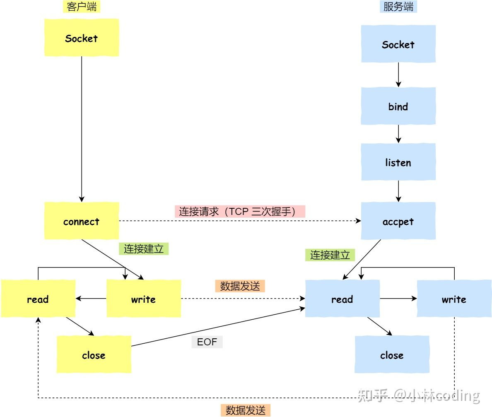
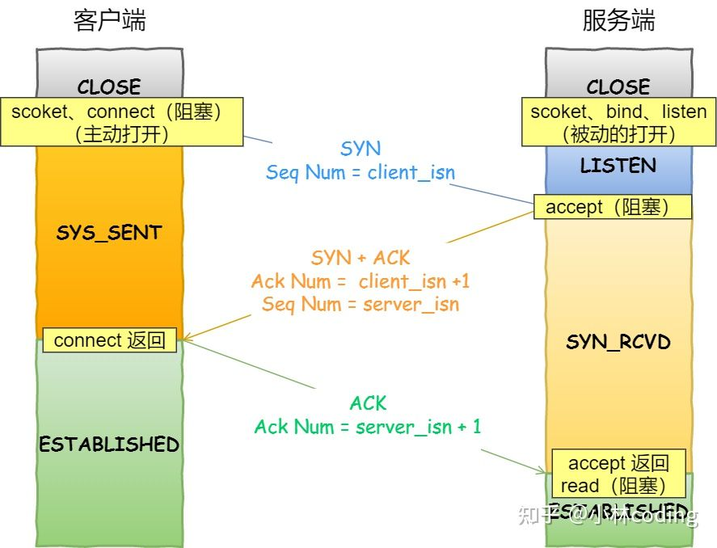

## 为什么结束过程需要四次挥手
https://www.zhihu.com/question/63264012/answer/298264454

因为TCP是全双工通信的
（1）第一次挥手     因此当主动方发送断开连接的请求（即FIN报文）给被动方时，仅仅代表主动方不会再发送数据报文了，但主动方仍可以接收数据报文。    （2）第二次挥手     被动方此时有可能还有相应的数据报文需要发送，因此需要先发送ACK报文，告知主动方“我知道你想断开连接的请求了”。这样主动方便不会因为没有收到应答而继续发送断开连接的请求（即FIN报文）。   
（3）第三次挥手    被动方在处理完数据报文后，便发送给主动方FIN报文；这样可以保证数据通信正常可靠地完成。发送完FIN报文后，被动方进入LAST_ACK阶段（超时等待）。   
（4）第四挥手    如果主动方及时发送ACK报文进行连接中断的确认，这时被动方就直接释放连接，进入可用状态。

ack是为了让对方闭嘴。结束，1)A不停的说,我想结束，不再发了。2)B收到后，但是还有数据没处理完，就发ack让A闭嘴。等我处理完再说。3)B终于处理完了，不停对A说，满足你结束吧。4)A知道B要结束了，给B说，可以闭嘴了，我结束。B收到结束，不再发送确认，进入关闭态

请问下如果第四次挥手没有会怎么样，反正此时双方已经发送完数据了，直接结束连接不就行了，为什么还需要再次确认呢？
进行第四次挥手，是要确保被动方的第三次挥手一定是被主动方接收到了（个人理解）
如果没有第四次挥手，被动方不知道主动方有没有收到被动方发送的fin=1，也就一直不能断开
被动方还会一直发送我这边处理完数据了，已经要关闭了
tcp中是一定要回复的，这是可靠传输的保证，没收到就会一直重发。[大笑]

# 参考

[Transmission_Control_Protocol](https://en.wikipedia.org/wiki/Transmission_Control_Protocol#Connection_establishment)

[socket编程到底是什么 ](https://www.zhihu.com/question/29637351/answer/1934423848)

